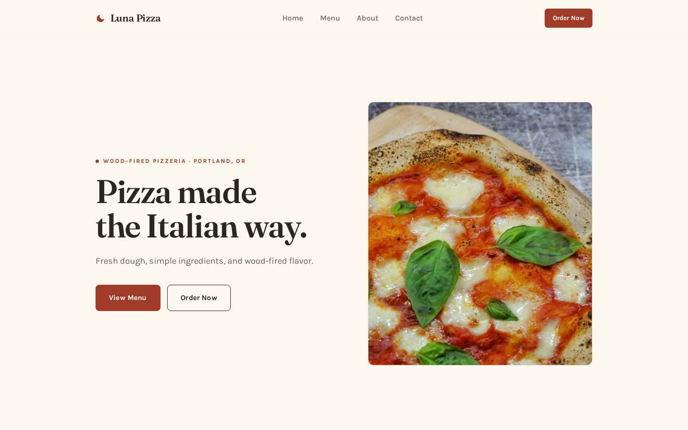
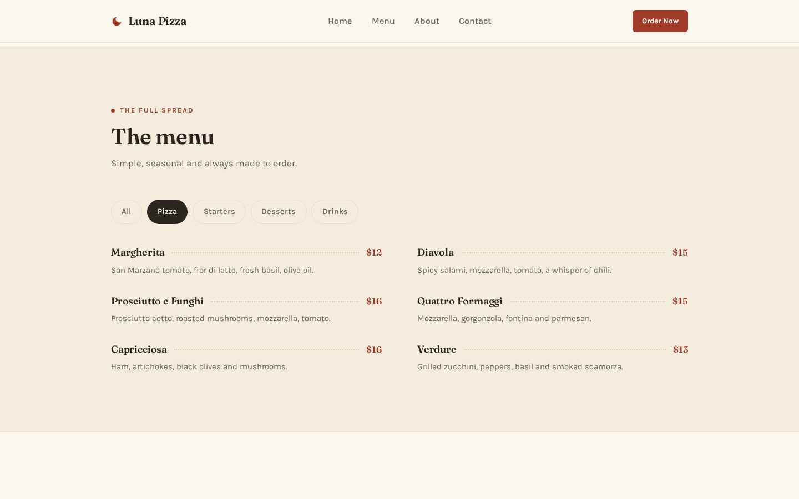
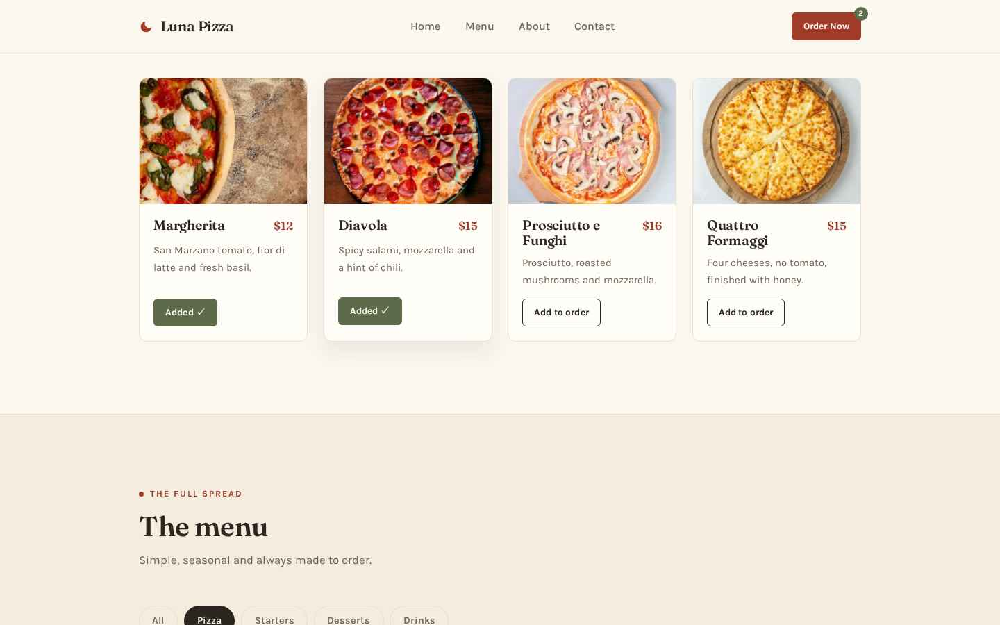
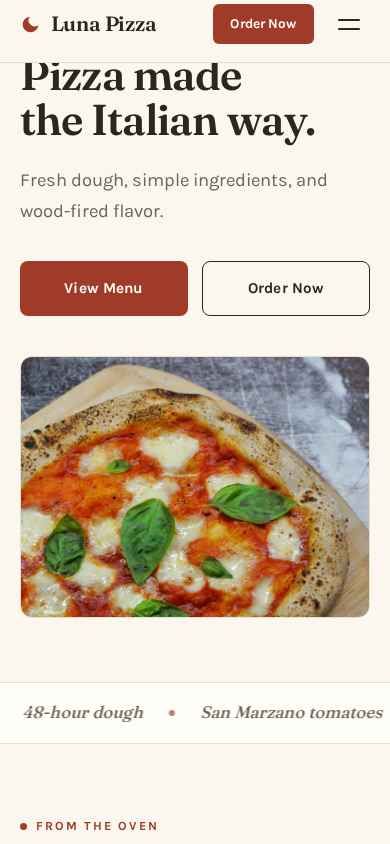
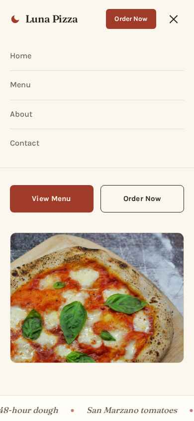
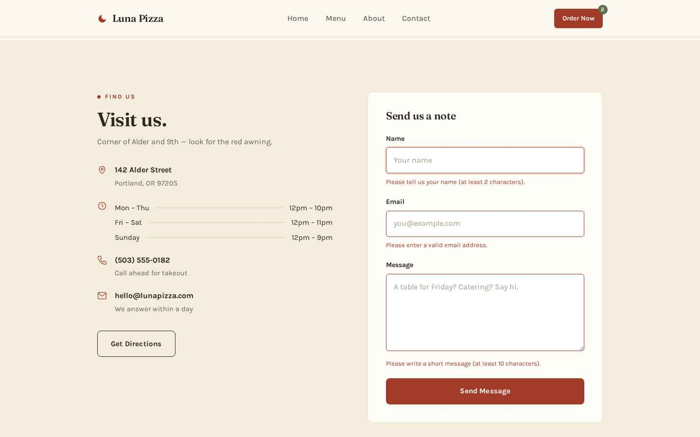

<div align="center">



# Luna Pizza

**Pizza made the Italian way.**

A polished single-page website for a fictional wood-fired pizzeria in Portland, Oregon.
Built with plain HTML, CSS and vanilla JavaScript — no frameworks, no build step, nothing to install.


</div>

---

## About

Luna Pizza is a small neighborhood pizzeria with a warm, natural Italian aesthetic: cream background, charcoal text, a muted dark red accent and touches of green. The goal was a site that feels like something a real local restaurant could actually use — clean typography, generous spacing, real photography, and just enough motion to feel alive without getting in the way.

Everything is hand-written: semantic HTML, one stylesheet driven by CSS variables, and about 150 lines of dependency-free JavaScript.

## Screenshots

**Menu filtering** — switch between All, Pizza, Starters, Desserts and Drinks:

| Filtered to pizza | Order counter after two "Add to order" clicks |
| --- | --- |
|  |  |

**Mobile first-class** — the layout collapses cleanly and the hamburger navigation opens a simple panel:

| Home | Navigation open |
| --- | --- |
|  |  |

**Contact form validation** — inline errors for empty or invalid fields, a friendly confirmation when the message is sent:



## Features

- **Sticky navbar** with a subtle hairline border on scroll and a mobile hamburger menu
- **Hero** with a masked line-by-line headline reveal and a gentle parallax on the photo
- **Featured pizzas** — four cards with prices and working "Add to order" buttons that bump a counter badge next to *Order Now*
- **Filterable menu** — 17 items across pizza, starters, desserts and drinks, styled as classic dotted-leader rows
- **Contact form** — front-end validation for name, email and message (no backend required)
- **Gallery** — six photos from the kitchen in a clean responsive grid
- **Footer** — navigation, opening hours, social placeholders and an auto-updating year
- **Accessible** — semantic landmarks, focus-visible styles, a skip link, and full `prefers-reduced-motion` support

## Getting started

```bash
git clone https://github.com/your-username/luna-pizza.git
cd luna-pizza
```

Then open `index.html` in a browser — or serve the folder:

```bash
npx serve .
```

There is nothing to install and nothing to build.

## Project structure

```
luna-pizza/
├── index.html            # All markup — semantic, single page
├── css/
│   └── style.css         # Design tokens + sections + responsive rules
├── js/
│   └── script.js         # Interactions, ~150 lines, zero dependencies
├── images/               # Site photos (optimized locally) + favicon
├── docs/
│   └── screenshots/      # Preview images used by this README
└── README.md
```

## Customization

- **Colors** live in CSS variables at the top of `css/style.css` — change five values to rebrand the whole site
- **Menu items** are plain HTML in `index.html`; the `data-category` attribute is all the filtering needs
- **Photos** are local files in `images/` — swap them out freely

## Tech

| | |
| --- | --- |
| Markup | Semantic HTML5, one page, no templates |
| Styling | Modern CSS: custom properties, grid, `aspect-ratio`, `scroll-margin-top` |
| Behavior | Vanilla JavaScript — navigation, filtering, order counter, validation, scroll reveals |
| Type | [Fraunces](https://fonts.google.com/specimen/Fraunces) + [Karla](https://fonts.google.com/specimen/Karla) via Google Fonts |
| Motion | CSS keyframes + IntersectionObserver, disabled under `prefers-reduced-motion` |

## Credits

- Photos from [Unsplash](https://unsplash.com)
- Fonts: Fraunces and Karla via [Google Fonts](https://fonts.google.com)
- Luna Pizza is a **fictional business** — this site is for demo and portfolio use

## License

Released under the [MIT License](LICENSE).
